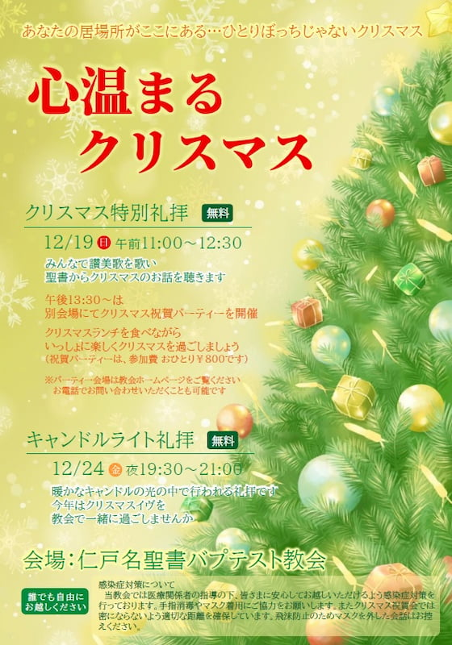

## 2021 クリスマス礼拝

---

| クリスマス特別礼拝 |
| ------------------------------- |
| 2021年12月19日（日）11:00 - 12:30 |

| クリスマス祝会 |
| ------------------------------- |
| 2021年12月19日（日）13:30 - 17:00 |
| 📍 <a href="https://maps.app.goo.gl/m2MRgFTcUewUbQ9f6" target="_blank">辺田町内会館 つどいの館</a> |

| キャンドルライト礼拝 |
| ------------------------------- |
| 2021年12月24日（金）19:30 - 21:00 |

---

### 2021 クリスマス祝会

クリスマス特別礼拝後は別会場にてクリスマス祝賀パーティーを開催します。クリスマスランチを食べながらいっしょに楽しくクリスマスを過ごしましょう。誰でも参加できますので、ぜひお気軽にお越しください。 

---

#### あなたは一人じゃない

今年もクリスマスの季節がやってきました。クリスマスを楽しく過ごすために大切なものは何でしょう。ケーキやごちそう、プレゼントではありません。一緒に過ごすことのできる大切な人 －家族や友人－ の存在です。

しかし、すべての人がそのような楽しいクリスマスを過ごせる訳ではありません。現代社会が抱える大きな闇の一つに孤独の問題があります。孤独の原因は何でしょうか。それは社会に愛がないことにあります。マザー・テレサは「愛の反対は無関心である」との名言を残しましたが、愛がないことの根本原因は自己中心にあります。自己中心とは、自分や自分が属しているコミュニティ（家族や友人グループ等）だけを大事にする生き方のことです。自己中心な生き方は、自分とつながりを持っていない人をあまり気に掛けなくなります。そうなると、一度孤立してしまった人は誰からも手を差し伸べられなくなり、ますます孤独になっていくのです。

では、どうしたら孤独から抜け出すことができるのでしょうか。

**①あなたと一緒にいてくださる神様を信じること**

聖書にはイエス・キリストの誕生に関する次のような言葉があります。

> 見よ、処女が身ごもっている。そして男の子を生む。その名はインマヌエルと呼ばれる －訳すと『神は私達と共におられる』という意味である－
> <cite>マタイの福音書1章23節</cite>

処女とはマリアのことです。マリアから生まれたキリストは「神は私達と共におられる」ということを伝えるために生まれました。あなたは孤独ではない、神はあなたと共にいてくださる、ということを身をもって教えたのがキリストだったのです。

**②隣人愛に生きること**

愛がない根本原因は自己中心であることを学びました。聖書では自己中心的な生き方のことを罪としています。自己中心という罪から救われなければ、孤独を解消することはできません。

> マリアは男の子を生みます。その名をイエスとつけなさい。この方こそご自分の民をその罪から救ってくださる方です
> <cite>マタイの福音書1章21節</cite>

キリストは私達を罪から救うために来られました。私達の罪の罰のために十字架で処刑され、3日目に復活したことで罪の赦しと罪からの解放をもたらしてくださいました。キリストを救い主として受け入れるなら罪が赦され、自己中心的な生き方が変えられていきます。すると、孤独の中ではなく隣人愛の中を生きていくことができます。

神様はあなたと共に生きてくださいます。あなたは独りぼっちではありません。だからこそ、教会のクリスマスイベントにあなたをご招待します。神様と共にクリスマスを過ごしてみませんか。
