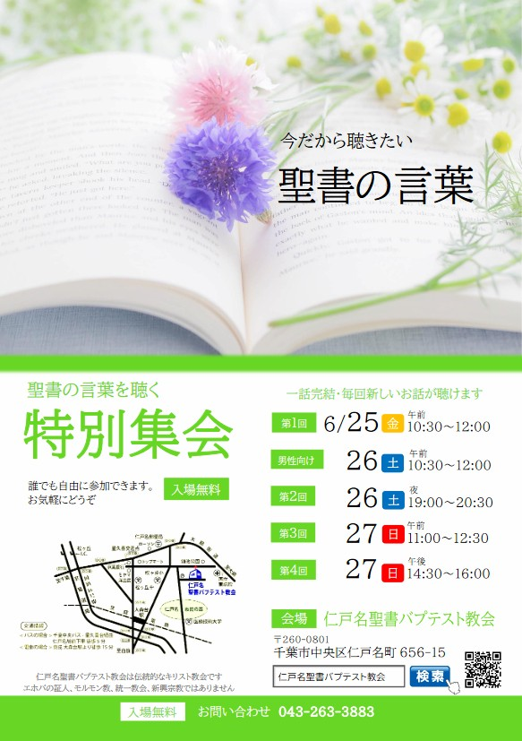

## 2021 初夏の特別集会

---

| 第1回 |
| ------------------------------ |
| 2021年6月25日（金）10:30 - 12:00 |

| 男性向け |
| ------------------------------ |
| 2021年6月26日（土）10:30 - 12:00 |

| 第2回 |
| ------------------------------ |
| 2021年6月26日（土）19:30 - 21:00 |

| 第3回 |
| ------------------------------ |
| 2021年6月27日（日）11:00 - 12:30 |

| 第4回 |
| ------------------------------ |
| 2021年6月27日（日）14:30 - 16:00 |

---

### 今だから聴きたい聖書の言葉

あなたは今、どのようなことに悩んでいますか。親子問題、夫婦問題、人間関係、将来のこと、健康のこと、失業、経済的なこと、コロナ禍のこと...人によって今かかえている問題は様々だと思います。

聖書は2千年も昔からそうした様々な悩みに光を与え続けてきました。2千年も昔から今に至るまでこれほど世界中で多くの人に読まれ続けてきた書物は聖書をおいて他にありません。

今、あなたが抱えている悩みについてのヒントも聖書にきっとあるはずです。なぜ聖書にはそれほどまでの魅力があるのでしょうか。
