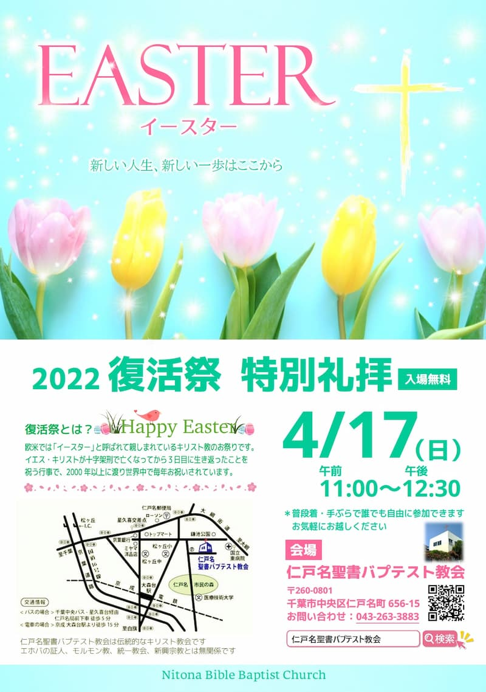

## 2022 復活祭特別礼拝

---

| 復活祭特別礼拝 |
| ------------------------------ |
| 2022年4月17日（日）11:30 - 12:30 |

---

### 復活祭とは

イースター（復活祭）はイエス・キリストの復活をお祝いするときです。イエス・キリストの復活がなければキリスト教は成立していなかったと言われるほど、キリストの復活は聖書の教えの中で大切な位置を占めています。しかしなぜ復活がそれほど大切なこととされているのでしょうか。ぜひ、聖書からキリストの復活の意味について考えてみませんか。初めての方も大歓迎です。どなたでもお気軽にお越しください。 

---

### メッセージ

#### ①ある宣教師と僧侶の会話

昔、ある宣教師が僧侶にこう尋ねました。
「青年時代と老年ではどちらが良いですか？」　
僧侶は答えます。
「もちろん、青年時代です。なぜなら、青年時代には健康があり、病が少なく痛みも少なく、まだまだこれからだ、という未来があります。しかし老人になると身体のあちこちに痛みがあり、病があらわれ、しかも老い先が短いのです。」

#### ②自分はどこに向かっているのか？

次に宣教師はこのように尋ねました。
「長い航海に出るとします。出航してから日が浅く、目的の港に着くまでにはまだ長い日数が残っています。もしかしたら途中で大嵐に遭うかも知れず、この先何が待ち受けているか分かりません。そのような地点にいる人と、長い航海を終え、目的の港まであともう少しという人では、どちらが喜んでいるでしょうか。」
僧侶「もう少しで港に着く方でしょう。」
宣教師「では人生の旅路にも同じことが言えるのではないですか。」
すると僧侶はこう言いました。
「そんなことはわかっています。しかし私には自分がどの港に向かっているのか、そしてその港がどんな所なのかも分からないのです。」

#### ③老い・死への対処法

老いていくことや死ぬことへの正しい対処法は、これから自分が向かおうとしている「あの世」について知っておくことです。もしいわゆる「あの世」というものが、笑顔と喜びにあふれる素晴らしい所で、先に旅立っていった人と再会でき、現世に残っている人ともいずれまた再会できるような所であれば、希望を抱いて安らかに旅立っていけます。しかし、もしあの世が何もない真っ暗な世界だとしたら、あるいは、あの世がどのような所か分からないものであれば、不安を感じることでしょう。

#### ④天国はあるのか？

聖書は、天国は存在する、と教えています。そこは生きている間の全ての苦しみから解放され、笑顔と喜びに溢れる素晴らしい所です。しかし全ての人が天国に行ける訳ではない、とも教えています。では、どうしたら天国に行くことができるのでしょうか。

#### ⑤天国に行くには

ある時イエス・キリストはこう言いました。
「私が道であり、真理であり、命なのです。私を通してでなければ、誰一人、父のみもとに来ることはありません」（ヨハネによる福音書14章6節）
「父のみもと」とは天国のことです。イエスだけが天国へと通じるたった１つの本当の道であり、イエスを信じ受け入れるなら、誰でも確実に天国に行けるというのです。

#### ⑥死ぬことはもう怖くない

イエスを信じ受け入れた人は、自分は確実に天国に行けるとわかっているので、老いや死を迎える中でも希望を失ってがっかりしてしまうことはありません。もちろん死ぬのは誰だって嫌ですし、悲しいものです。けれどもそのような中にあっても、天国で第二の人生が始まること、そして死別しても、また天国で再会できるという期待を持つことができるのです。そのような希望はその人を勇気づけ、自分に与えられた人生を最後の最後まで大切に生き抜く力をもたらします。

#### ⑦あなたは大丈夫？

あなたは死の向こう側にある世界について確実に言えることを何か持っているでしょうか。自分は天国に行けるという保証が本当にありますか。この機会にイエス・キリストが言われた天国への希望をあなたも聖書から学んでみませんか。 
