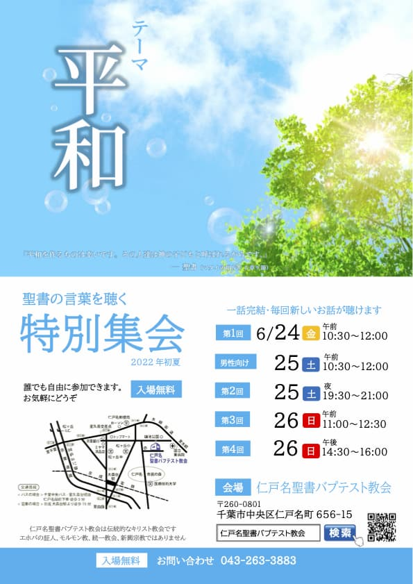
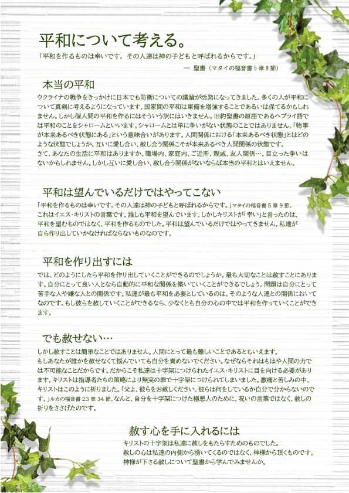

## 2022 初夏の特別集会

---

| 第1回 |
| ------------------------------ |
| 2022年6月24日（金）10:30 - 12:00 |

| 男性向け |
| ------------------------------ |
| 2022年6月25日（土）10:30 - 12:00 |

| 第2回 |
| ------------------------------ |
| 2022年6月25日（土）19:30 - 21:00 |

| 第3回 |
| ------------------------------ |
| 2022年6月26日（日）11:00 - 12:30 |

| 第4回 |
| ------------------------------ |
| 2022年6月26日（日）14:30 - 16:00 |

---

### 平和について考える

> 平和を作るものは幸いです。その人達は神の子どもと呼ばれるからです。
> <cite>マタイの福音書5章9節</cite>

#### 本当の平和

ウクライナの戦争をきっかけに日本でも防衛についての議論が活発になってきました。多くの人が平和について真剣に考えるようになっています。国家間の平和は軍備を増強することであるいは保てるかもしれません。しかし個人間の平和を作るにはそういう訳にはいきません。旧約聖書の原語であるヘブライ語では平和のことをシャロームといいます。シャロームとは単に争いがない状態のことではありません。「物事が本来あるべき状態にある」という意味合いがあります。人間関係における「本来あるべき状態」とはどのような状態でしょうか。互いに愛し合い、赦し合う関係こそが本来あるべき人間関係の状態です。
さて、あなたの生活に平和はありますか。職場内、家庭内、ご近所、親戚、友人関係...。目立った争いは ないかもしれません。しかし互いに愛し合い、赦し合う関係がないならば本当の平和とはいえません。

#### 平和は望んでいるだけではやってこない

「平和を作るものは幸いです。その人達は神の子どもと呼ばれるからです。」マタイの福音書5章9節
これはイエス・キリストの言葉です。誰しも平和を望んでいます。しかしキリストが「幸い」と言ったのは、平和を望むものではなく、平和を作るものでした。平和は望んでいるだけではやってきません。私達が自ら作り出していかなければならないものなのです。

#### 平和を作り出すには

では、どのようにしたら平和を作り出していくことができるのでしょうか。最も大切なことは赦すことにあります。自分にとって良い人となら自動的に平和な関係を築いていくことができるでしょう。問題は自分にとって苦手な人や嫌な人との関係です。私達が最も平和を必要としているのは、そのような人達との関係においてなのです。もし彼らを赦していくことができるなら、少なくとも自分の心の中では平和を作っていくことができます。

##### でも赦せない...

しかし赦すことは簡単なことではありません。人間にとって最も難しいことであるともいえます。
もしあなたが誰かを赦せなくて悩んでいても自分を責めないでください。なぜならそれはもはや人間の力では不可能なことだからです。だからこそ私達は十字架につけられたイエス・キリストに目を向ける必要があります。キリストは指導者たちの策略により無実の罪で十字架につけられてしまいました。激痛と苦しみの中、キリストはこのように祈りました。「父よ、彼らをお赦しください。彼らは何をしているか自分で分からないのです。」ルカの福音書23章34節。なんと、自分を十字架につけた極悪人のために、呪いの言葉ではなく、赦しの祈りをささげたのです。

#### 赦す心を手に入れるには

キリストの十字架は私達に赦しをもたらすためのものでした。赦しの心は私達の内側から湧いてくるのではなく、神様から頂くものです。神様が下さる赦しについて聖書から学んでみませんか。
