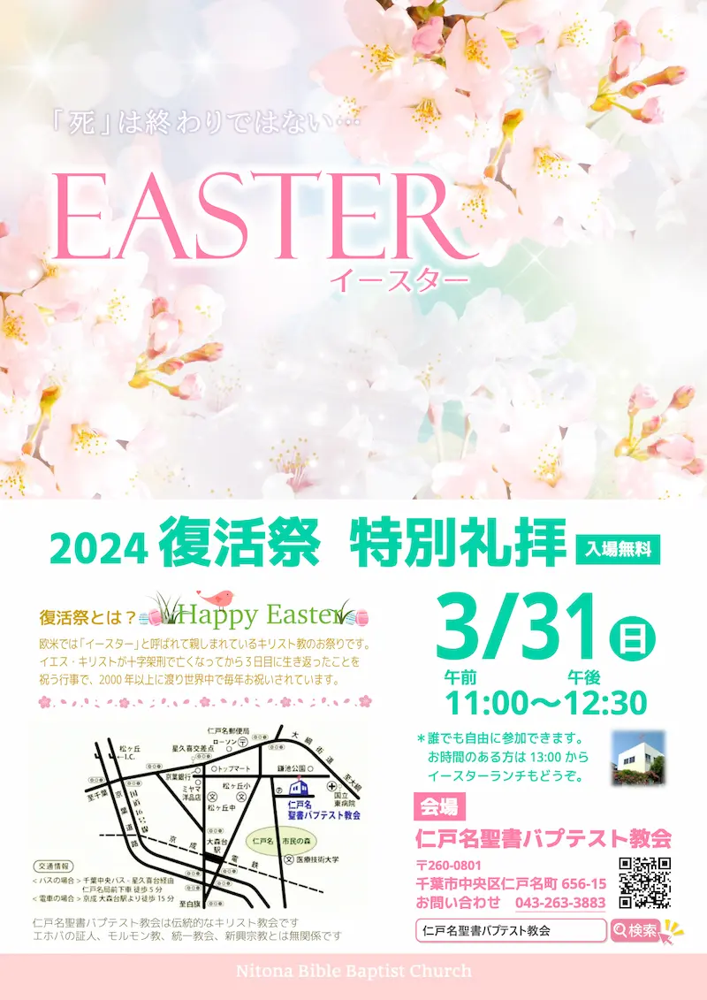
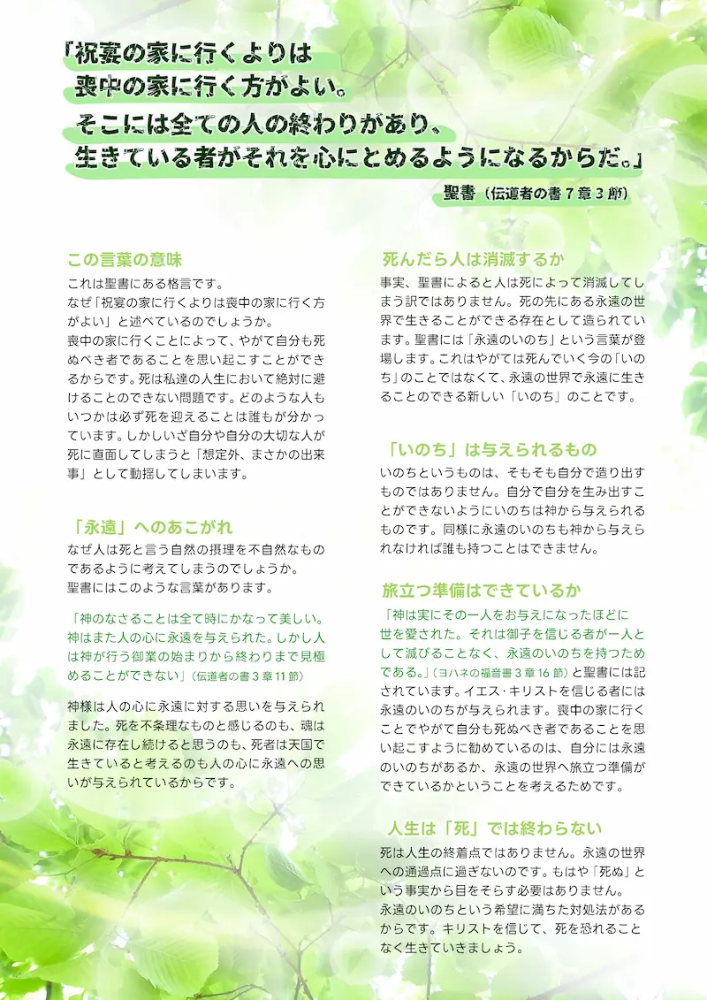

## 2024 復活祭特別礼拝

---

| 復活祭特別礼拝 |
| ------------------------------ |
| 2024年3月31日（日）11:00 - 12:30 |

| イースターランチ |
| ------------------------------ |
| 2024年3月31日（日）13:00 - 15:00 |
| 🎫 500円 / 1人 |
---

死はどんな人にも平等に訪れます。裕福な人も貧しい人も、健康な人も病弱な人も、いずれは避けられない運命として死を迎えます。

多くの人は死について考えたり話したりすることを避けがちです。それは、死に対する解決策が見出されないためです。

しかし、イエス・キリストはこの死の問題を乗り越える道を示してくださったのです。キリストを信じる者にとって、死は人生の終わりや破滅を意味するものではありません。キリストを信じる者は、死をもってしてもなお、希望を持ち続けることができます。

聖書から、死を乗り越える希望について学びませんか。皆様をお待ちしております。

また、礼拝後には婦人会手作りのランチをご用意しております。お時間のある方は、ぜひ集会後のランチにもご参加ください。
